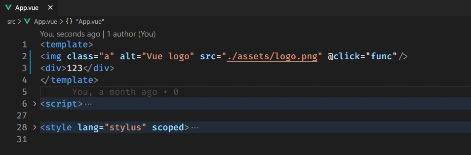
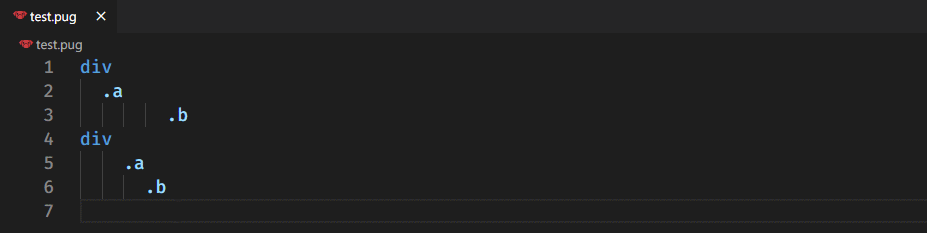
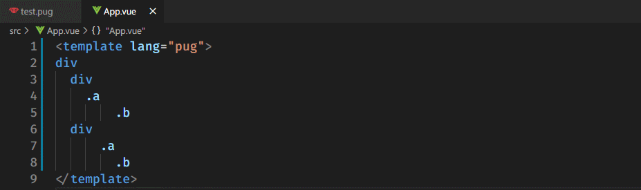
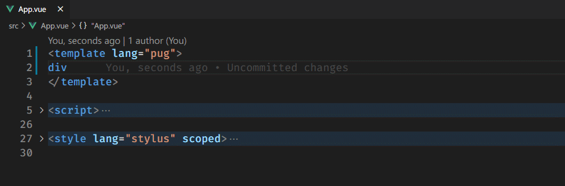
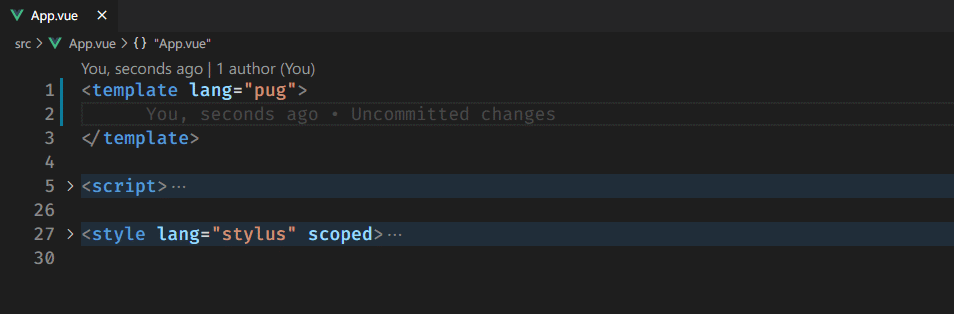
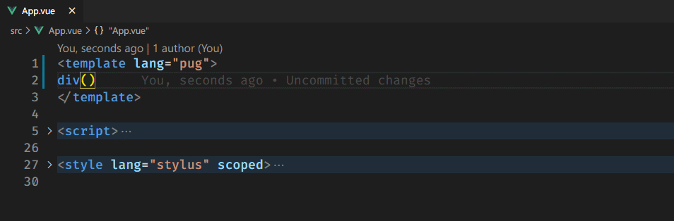

# Vue Pug Enhanced

## Features

- Code snippets for .vue files with pug template.
- Transform html to pug or pug to html.

## Supported languages

- Pug
- Jade
- Vue

## Usage

### **Transform**

1. Create a selection.
2. Press `F1` or `Ctrl + Shift + P`.
3. Run the command named `Html to Pug` or `Pug to Html` to transform.

**commands**:

- Vue Pug Enhanced: Html to Pug
- Vue Pug Enhanced: Pug to Html

### **Format Pug Document**

1. Open a pug/jade file.
2. Press `Ctrl + Shift + P`
3. Enter `Format Pug`

**commands**:

- Vue Pug Enhanced: Format Pug

> Note: this command only support pug/jade file.

### **Format Pug Selection**

1. Create a selection.
2. Press `F1` or `Ctrl + Shift + P`.
3. Run the command named `Format Pug Selected`.

- Vue Pug Enhanced: Format Pug Selected

> Note: this command support every file.

In vue file:

### **Code Snippets**

> v-for

> v-if

> Create Elements

> Events

## Release Notes

### 1.0.0

- Initial Extension
- Add command: Html to Pug
- Add command: Pug to Html
- Add snippets

### 1.0.2

- Add command: Format Pug
- Add command: Format Pug Selected

## Based On

- [vetur](https://github.com/vuejs/vetur)
- [pug](https://github.com/pugjs/pug)
- [html2pug](https://github.com/izolate/html2pug)
- [html2jade](https://github.com/donpark/html2jade)
- [pug-beautify](https://github.com/vingorius/pug-beautify)

## References

- [formatter-pug](https://marketplace.visualstudio.com/items?itemName=alexbabichev.formatter-pug)
- [vscode-html-pug-convertor](https://marketplace.visualstudio.com/items?itemName=waynehong.vscode-html-pug-convertor)
- [vue-pug-snippets](https://marketplace.visualstudio.com/items?itemName=kaangokdemir.vue-pug-snippets)
- [vscode-jade-snippets](https://marketplace.visualstudio.com/items?itemName=mrmlnc.vscode-jade-snippets)
- [vscode-angular-pug](https://github.com/ghaschel/vscode-angular-pug)

**Enjoy!**
