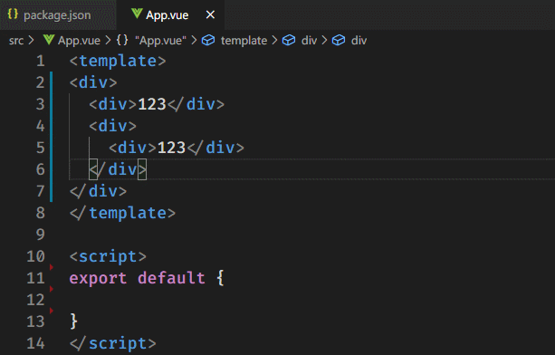
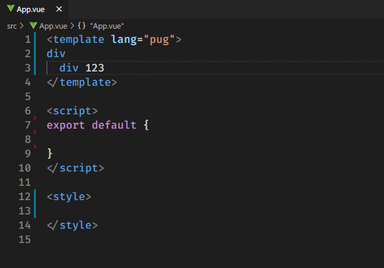
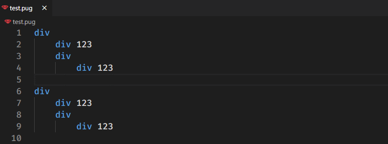
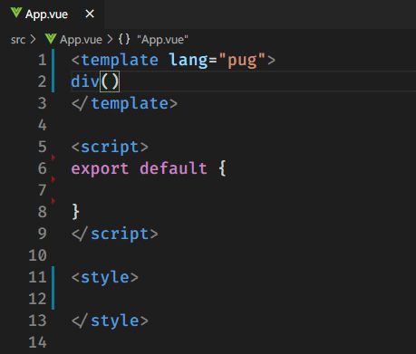
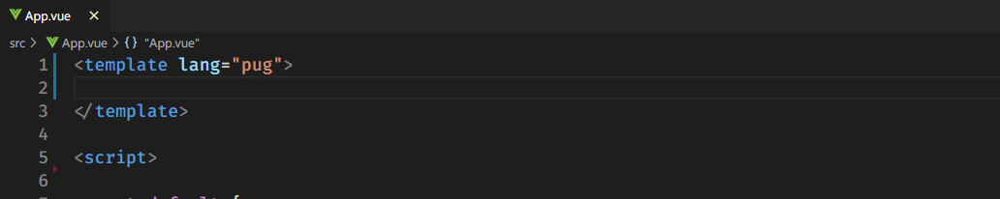

# Vue Pug Enhanced

[](https://marketplace.visualstudio.com/items?itemName=quanzaiyu.vscode-vue-pug-enhanced)


[](http://opensource.org/licenses/MIT)

<div align="center">

</div>

## Features

- Code snippets for .vue files with pug template.
- Transform html to pug or pug to html.
- Format pug document or format pug selection.
- Autocomplete.

## Supported languages

- Pug/Jade
- Vue

## Usage

### **Transform**

1. Create a selection.
2. Press `F1` or `Ctrl + Shift + P`.
3. Run the command named `Html to Pug` or `Pug to Html` to transform.

> Html to Pug



> Pug to Html



**commands**:

- Vue Pug Enhanced: Html to Pug
- Vue Pug Enhanced: Pug to Html

### **Format Pug**

1. Open a pug/jade/vue file.
2. Press `Ctrl + Shift + P`
3. Enter `Format Pug`




**commands**:

- Vue Pug Enhanced: Format Pug

### **Autocomplete**

> Vue Events



### **Code Snippets**

> v-for


> v-if



> Create Elements


## Supported settings

### vscode-vue-pug-enhanced.useTab

```
Type: Boolean
Default: false
Description: Indent with Tabs, if false, with spaces.
```

### vscode-vue-pug-enhanced.tabSize

```
Type: Number
Default: 2
Description: The number of spaces to indent generated files with. Default is 2 spaces. When `fillTab` is false, fill `tabSize` spaces.
```

### vscode-vue-pug-enhanced.doubleQuotes

```
Type: Boolean
Default: true
Description: Use double quotes for attributes.
```

### vscode-vue-pug-enhanced.omitDiv

```
Type: Boolean
Default: false
Description: Omit div tag when it has id or class.
```

### vscode-vue-pug-enhanced.omitCommas

```
Type: Boolean
Default: true
Description: Omit attribute separating commas.
```

## Known issues

- None

## Based On

- [vetur](https://github.com/vuejs/vetur)
- [pug](https://github.com/pugjs/pug)
- [html2pug](https://github.com/izolate/html2pug)
- [html2jade](https://github.com/donpark/html2jade)
- [pug-beautify](https://github.com/vingorius/pug-beautify)

## References

- [formatter-pug](https://marketplace.visualstudio.com/items?itemName=alexbabichev.formatter-pug)
- [vscode-html-pug-convertor](https://marketplace.visualstudio.com/items?itemName=waynehong.vscode-html-pug-convertor)
- [vue-pug-snippets](https://marketplace.visualstudio.com/items?itemName=kaangokdemir.vue-pug-snippets)
- [vscode-jade-snippets](https://marketplace.visualstudio.com/items?itemName=mrmlnc.vscode-jade-snippets)
- [vscode-angular-pug](https://github.com/ghaschel/vscode-angular-pug)

**Enjoy!**
